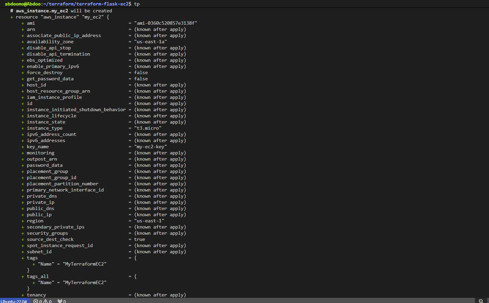
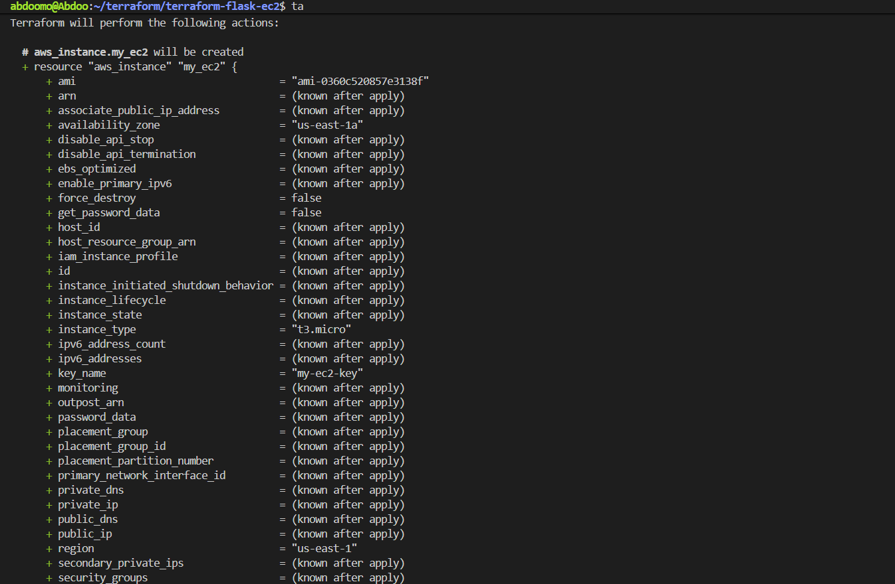
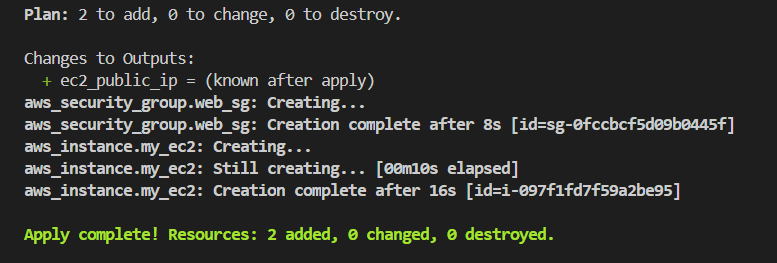

# Terraform + Flask Deployment on AWS EC2

This repository demonstrates how to deploy a **Flask web application** on an **AWS EC2 instance** using **Terraform**. The project combines **Infrastructure as Code** with **automated server setup**, allowing you to launch a fully functional web app in the cloud with minimal manual configuration.

This setup is ideal for learning how to:

* Use Terraform to provision AWS resources
* Automate server configuration using a startup script (`userdata.sh`)
* Deploy Python Flask applications on EC2 instances
* Manage security using AWS Security Groups

---

## **1️⃣ main.tf – Infrastructure as Code**

The `main.tf` file defines all AWS resources, including:

1. **Terraform provider**
2. **AWS region and VPC**
3. **Security Group** for SSH and HTTP access
4. **EC2 instance** with user data script
5. **Output** for the EC2 public IP

This approach ensures that all your cloud infrastructure is **version-controlled, reproducible, and easy to manage**.

### Sections Explained:

```hcl
terraform {
  required_providers {
    aws = {
      source  = "hashicorp/aws"
      version = "~> 6.0"
    }
  }
}
```

* Specifies **AWS as the provider**.
* Version `6.0` ensures compatibility with recent Terraform releases.

```hcl
provider "aws" {
  region = "<your region>"
}
```

* Configures the **AWS region** where resources will be provisioned.
* Replace `<your region>` with your target region (e.g., `us-east-1`).

```hcl
data "aws_vpc" "default" {
  default = true
}
```

* Retrieves the **default VPC** from your AWS account.
* All resources, including Security Groups and EC2 instances, will reside inside this VPC.

---

### Security Group

```hcl
resource "aws_security_group" "web_sg" {
  name        = "web-sg"
  description = "Allow SSH, HTTP, and Flask traffic"
  vpc_id      = data.aws_vpc.default.id

  ingress {
    description = "SSH"
    from_port   = 22
    to_port     = 22
    protocol    = "tcp"
    cidr_blocks = ["0.0.0.0/0"]
  }

  ingress {
    description = "HTTP"
    from_port   = 80
    to_port     = 80
    protocol    = "tcp"
    cidr_blocks = ["0.0.0.0/0"]
  }

  egress {
    from_port   = 0
    to_port     = 0
    protocol    = "-1"
    cidr_blocks = ["0.0.0.0/0"]
  }

  tags = { Name = "web-sg" }
}
```

* **Inbound rules** allow SSH (port 22) and HTTP (port 80).
* **Outbound rules** allow all traffic.
* This ensures your EC2 instance can be accessed securely while still serving your web app to the public internet.

---

### EC2 Instance

```hcl
resource "aws_instance" "my_ec2" {
  ami                    = "<your ami id>"
  instance_type          = "<your instance type>"
  key_name               = "<your key name>"
  vpc_security_group_ids = [aws_security_group.web_sg.id]
  availability_zone      = "<your availability zone>"

  user_data = file("userdata.sh")

  tags = { Name = "<your EC2 name>" }
}
```

* **AMI** → OS image for the instance
* **Instance type** → defines compute resources
* **Key name** → SSH key for secure login
* **Availability zone** → specify where to launch the instance
* **User data** → runs `userdata.sh` to set up Python and Flask automatically
* **Tags** → makes it easy to identify your instance in the AWS console

---

### Output

```hcl
output "ec2_public_ip" {
  value = aws_instance.my_ec2.public_ip
}
```

* Provides the **public IP** of your EC2 instance after deployment.
* This is essential for accessing your Flask app from a browser.

---

## **2️⃣ userdata.sh – Automated Server Setup**

`userdata.sh` is a **bash script executed automatically when the EC2 instance boots**. It automates the installation of dependencies and launches the Flask application.

### Script Breakdown:

```bash
#!/bin/bash
# Update the system and install Python3, pip, and virtualenv
apt update -y
apt install -y python3-pip python3-venv -y
```

* Ensures the server is up-to-date.
* Installs **Python3**, **pip**, and **venv** for isolated Python environments.

---

```bash
# Create a virtual environment and install Flask
python3 -m venv /home/ubuntu/flaskenv
/home/ubuntu/flaskenv/bin/pip install flask
```

* Creates a **virtual environment** to isolate the Flask installation.
* Avoids conflicts with system Python packages.

---

```bash
# Create a simple Flask application
tee /home/ubuntu/app.py > /dev/null <<EOT
from flask import Flask
app = Flask(__name__)

@app.route('/')
def home():
    return "<h1>🚀 Hello from AWS EC2 Flask App!</h1>"

if __name__ == "__main__":
    app.run(host="0.0.0.0", port=80)
EOT
```

* Defines a **single-page Flask app**
* `host="0.0.0.0"` → allows external access from the public IP
* `port=80` → serves the app on the standard HTTP port

---

```bash
# Run Flask in the background with root privileges
sudo /home/ubuntu/flaskenv/bin/python /home/ubuntu/app.py &
```

* Launches the Flask app **in the background**, allowing EC2 boot to complete.
* `sudo` is required because port 80 requires root privileges.
* `&` ensures the process does not block other startup tasks.

---

## **Why This Approach**

* **Infrastructure as Code** (`main.tf`) ensures the environment is reproducible and easy to version-control.
* **Automated setup** (`userdata.sh`) eliminates manual installation steps.
* **Security Groups** ensure your instance is accessible but protected.
* **Background Flask process** allows the web app to start automatically on boot.

---

## **Quick Access**

After applying Terraform:

```bash
terraform apply -auto-approve
```

Retrieve your instance public IP:

```bash
terraform output ec2_public_ip
```

Open in your browser:

```
http://<EC2-Public-IP>/
```

You will see your Flask web application running live!

## **3️⃣ Step-by-Step Deployment with Screenshots**

The following section demonstrates the deployment process with visual evidence of each step.

---

### **Step 1: Terraform Initialization**


* Command used:

```bash
terraform init
```

* Initializes the Terraform working directory.
* Downloads the AWS provider plugin and prepares the environment.
* Output confirms: *"Terraform has been successfully initialized!"*

---

### **Step 2: Terraform Plan**



* Command used:

```bash
terraform plan
```

* Shows a preview of the changes Terraform will make.
* Indicates two resources will be created:

  1. `aws_instance.my_ec2` (EC2 instance)
  2. `aws_security_group.web_sg` (Security Group)
* The plan summary states:
  *“Plan: 2 to add, 0 to change, 0 to destroy”*

---

### **Step 3: Terraform Apply**



* Command used:

```bash
terraform apply -auto-approve
```

* Executes the plan and provisions the infrastructure.
* Shows the creation of the Security Group and EC2 instance:




  * `aws_security_group.web_sg: Creation complete`
  * `aws_instance.my_ec2: Creation complete`
* Confirms: *"Apply complete! Resources: 2 added, 0 changed, 0 destroyed"*

---

### **Step 4: Terraform Output**


* Command used:

```bash
terraform output
```

* Displays the public IP of the newly created EC2 instance:
  `"13.222.247.168"`
* This IP is used to access the deployed Flask web application.

---

### **Step 5: Accessing the Web Application**


* Open a web browser and enter the public IP:

```text
http://13.222.247.168/
```

* Successfully loads the Flask web app with the message:
  *"Hello from AWS EC2 Flask App with Abdelrahman Mohamed !"*
* Confirms that the EC2 instance and Flask app are publicly accessible.

---

✅ **Conclusion**

* These screenshots demonstrate a **full end-to-end deployment**:

  * Initializing Terraform
  * Planning and applying changes
  * Retrieving outputs
  * Accessing the Flask web app on a live EC2 instance
* This visual guide complements the `main.tf` and `userdata.sh` setup
* This combination of `main.tf` and `userdata.sh` provides a **fully automated, reproducible, and shareable AWS Flask deployment**, ideal for learning, demos, or lightweight web apps. All sensitive values are replaced with `<your ...>` to make the project safe for sharing on GitHub.
  
  ---
